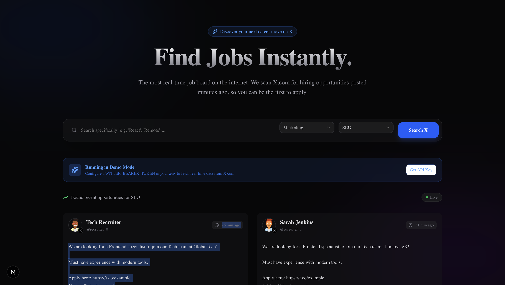

# GetJob 🚀
### Real-time Hiring Insights from X.com

GetJob is a high-performance, premium job search platform that scans X.com (Twitter) for the latest hiring opportunities across various industries. Built with **Next.js 16**, **Tailwind CSS v4**, and **Shadcn UI**.



## ✨ Features

- **Real-time Scanning**: Queries X.com Search API v2 for the most recent job postings (updated minutes ago).
- **Industry Filters**: Specialized filtering for Tech, Marketing, Accounting, Design, and Sales.
- **Deep Categorization**: Tech roles include Frontend, Backend, Fullstack, Cybersecurity, DevOps, Mobile, and AI/ML.
- **Premium UI**: Modern dark theme with glassmorphism, smooth animations, and responsive design.
- **Direct Redirection**: Click on any job to view the original post on X.com instantly.
- **Demo Mode**: Built-in mock data fallback for immediate testing even without an API key.

## 🚀 Getting Started

### 1. Prerequisites

- Node.js 18+
- An X (Twitter) Developer Account (Basic tier recommended for search access).

### 2. Installation

```bash
git clone https://github.com/aadityakumarsah/getyourjobinx.git
cd getyourjobinx
npm install
```

### 3. Environment Variables

Create a `.env` file in the root directory and add your X Bearer Token:

```env
TWITTER_BEARER_TOKEN=your_bearer_token_here
```

### 4. Run Locally

```bash
npm run dev
```

The app will be available at `http://localhost:3000`.

## ⚠️ Notes on X API Tiers

*   **Free Tier**: This tier does not support searching for tweets. The app will automatically run in **Demo Mode** (showing mock jobs) if you use a Free tier token.
*   **Basic Tier ($100/mo)**: Required for live job searching. Supports up to 10,000 tweets/month.

## 🛠️ Built With

- [Next.js](https://nextjs.org/)
- [Tailwind CSS v4](https://tailwindcss.com/)
- [Shadcn UI](https://ui.shadcn.com/)
- [Lucide Icons](https://lucide.dev/)

---
Developed with ❤️ by [Aaditya](https://github.com/aadityakumarsah)
